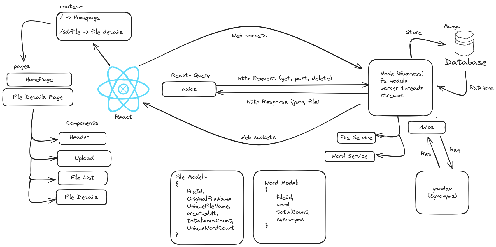
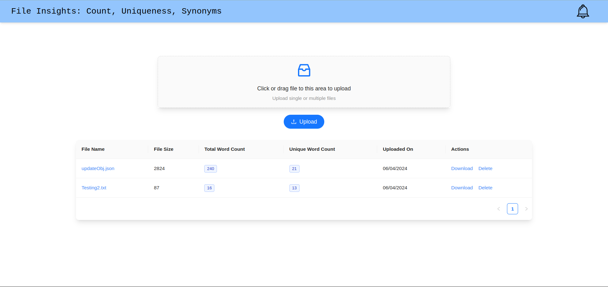

---
# File Insights: Count, Uniqueness, Synonyms
Welcome to the File Analytics App! This application allows users to upload files, analyze their content, and perform various operations such as word count analysis and masking specific words. With real-time notifications and seamless integration between the frontend and backend, this app provides a smooth user experience for managing and analyzing files.

## Components:

### Front End: React.js
- **HomePage**
- **Header**
- **UploadFile.js**
- **FileList.js**
- **FileDetails.js**

### Backend: Node.js
- **API Routes (Express)**
  - **/files (GET)** - Fetches uploaded files
  - **/files/:id/words (GET)** - Fetches word count details
  - **/files/upload (POST)** - Handles file upload
  - **/files/:id/download (POST)** - Handles masked file download
  - **/files/:fileId (DELETE)** - Deletes a file

### Business Logic
- **handleFetchUploadedFiles**
- **handleFetchWordCountDetails**
- **handleUploadFiles** (includes duplicateFileValidation)
- **handleDownloadMaskedFile**
- **handleDeleteFile**

### Database (MongoDB)
- **Files Collection** (stores file information with unique file ID)
- **Words Collection** (stores individual words as documents with synonym lists)

## Packages:
### Frontend:
- react-router-dom
- react-query

### Backend:
- multer
- mongoose
- express
- uuid
- socket.io
- axios

## Connections:
(Refer to the diagram below for a visual representation)
- **Frontend - User Interaction:** Users interact with the application through the frontend components.
- **Frontend - API Calls:** Frontend components use react-router-dom for routing and react-query for fetching and caching data. They make API calls to the backend using appropriate URLs.
- **Frontend - Styling:** Frontend styling is done using tailwind css and ant design.
- **Backend - API Routes:** The backend uses Express to define API routes. These routes handle incoming requests from the frontend.
- **Backend - Business Logic:** Each API route calls the corresponding business logic function (e.g., handleFetchUploadedFiles for the /files GET route).
- **Backend - Database Interaction:** Business logic functions interact with the MongoDB database using Mongoose. They retrieve, update, or delete data from the Files and Words collections.
- **Backend - File Storage:** Multer handles file storage during upload.
- **Backend - External API Calls:** Backend uses axios to make external API calls for synonym retrieval.
- **Backend - Notifications:** Backend uses socket.io to send notifications to the frontend once file processing is complete.

## Supported File Types:
The application currently supports uploading and processing plain text files with the following extensions:
- .txt
- .html
- .css
- .js
- .json
- .xml
- .md
- .csv




## Setup Instructions

### Prerequisites

- Git
- Node.js and npm (or yarn)
- MongoDB
- React

### Steps

1. **Clone the Repository**:
   - Open a terminal or command prompt and navigate to your desired local directory where you want to clone the project.
   - Run the following command:
     ```
     git clone https://github.com/rishabh-in/file-analytics.git
     ```
   This will create a new directory named `file-analytics` on your system, containing the application's source code.

2. **Set Up the Backend (server directory)**:
   - Navigate to the backend directory:
     ```
     cd file-analytics/server
     ```

3. **Import the .env file (if applicable)**:
   - If the project uses a `.env` file for environment variables (like database connection strings), make sure you have it available in the server directory.
   - Paste the contents of the provided `.env` file into this directory. You might need to create the `.env` file yourself if it's not included.

4. **Install Dependencies**:
   ```
   npm install
   ```

5. **Start the Backend Server**:
   ```
   node start
   ```

6. **Set Up the Frontend (Client directory)**:
   - Navigate to the frontend directory:
     ```
     cd ../Client
     ```

7. **Install Frontend Dependencies (using Node.js version 16)**:
   ```
   nvm use 16  # Assuming you have nvm installed for managing Node.js versions
   npm install
   ```

8. **Start the Frontend Server**:
   ```
   npm start
   ```

   This will launch the frontend development server, usually accessible at http://localhost:3000 (verify the port if different).


### UI Images



### Verification

- Open your web browser and navigate to http://localhost:3000 to access the frontend application.
- If everything is set up correctly, you should see the application's interface.

By following these steps, you should have your file upload and word analysis application running locally, ready for exploration and development.

---

Feel free to customize the setup instructions or add any additional information as needed.